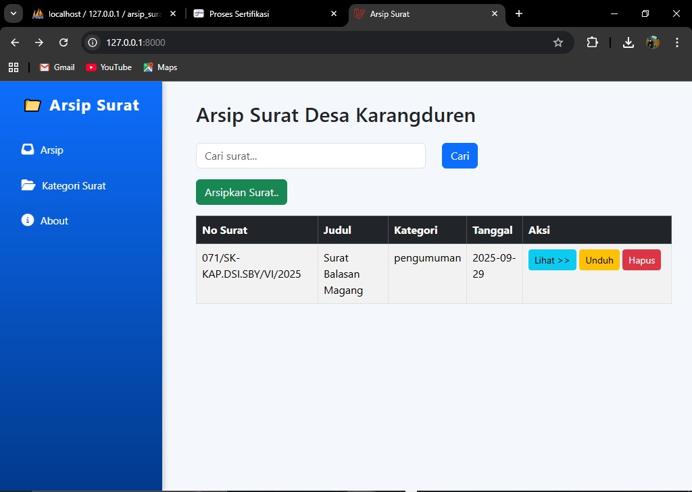
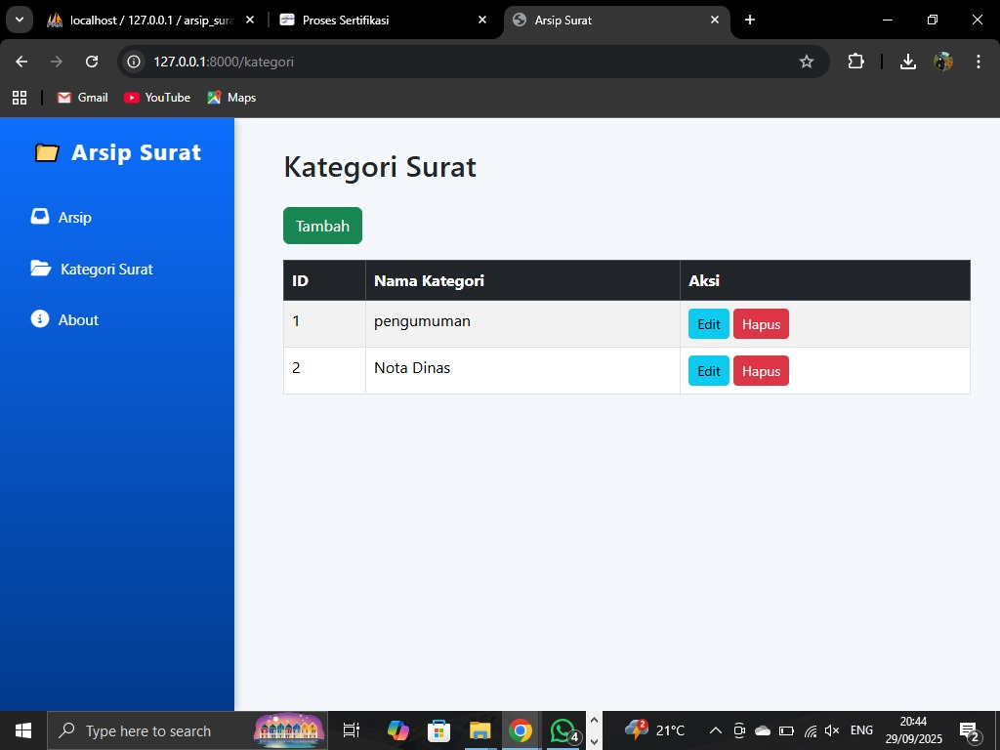
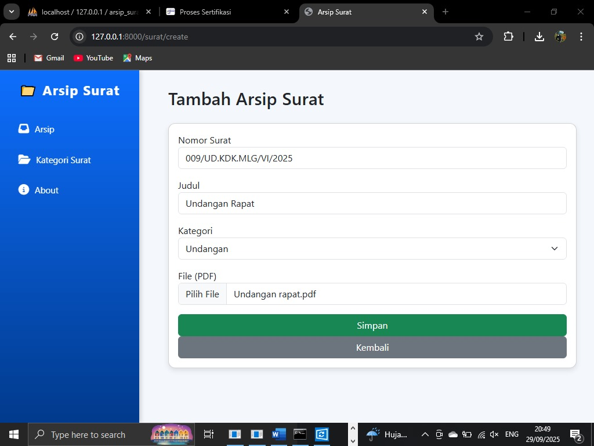
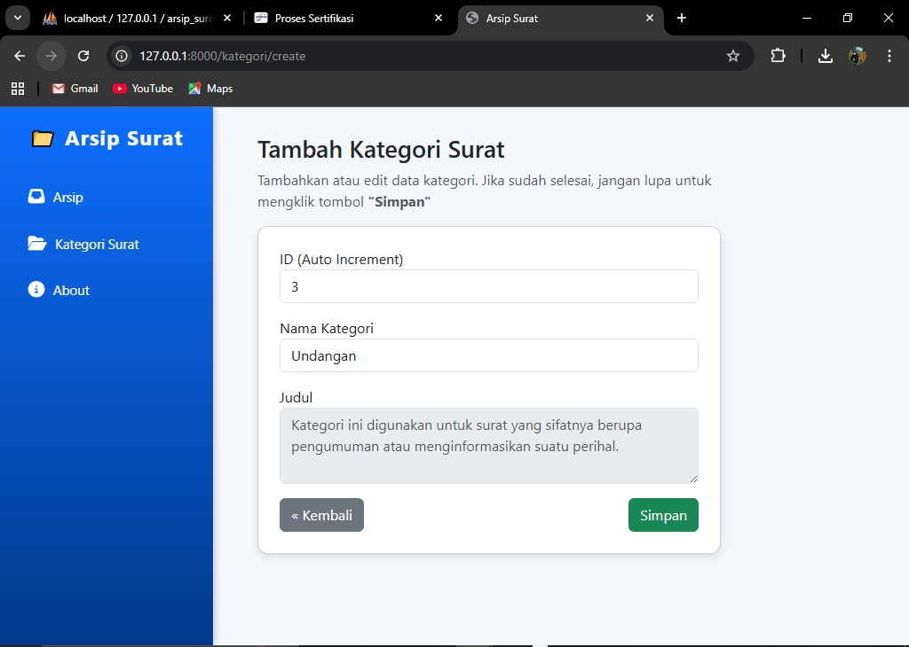
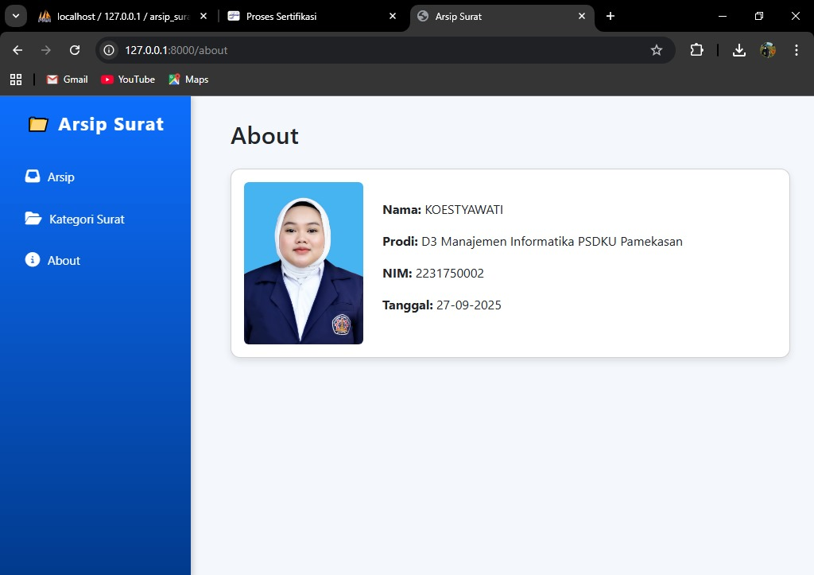

# Sistem Arsip Surat Digital

Aplikasi web untuk mengelola arsip surat masuk dan surat keluar secara digital.

## Tujuan
- Digitalisasi arsip surat manual
- Memudahkan pencarian dan retrieval surat
- Mengelola kategori surat secara terstruktur

## Fitur Utama
- Upload dan manajemen surat
- Kategorisasi surat (pengumuman, undangan, dll)
- Pencarian surat berdasarkan nomor, judul, kategori
- Preview file PDF

## Teknologi yang Digunakan
- Framework: Laravel
- Database: MySQL
- Frontend: Bootstrap, HTML, CSS
- File Storage: Local filesystem

## Screenshots

### Home


### Kategori Surat


### Tambah Arsip


### Tambah Kategori


### About



## Instalasi & Menjalankan

### Prerequisites
- PHP 8.0+
- Composer
- MySQL
- Web server (Apache/Nginx)

### Langkah Instalasi

1. Clone repository
   ```bash
   git clone https://github.com/Koestyawati/arsip-surat.git
   cd arsip-surat